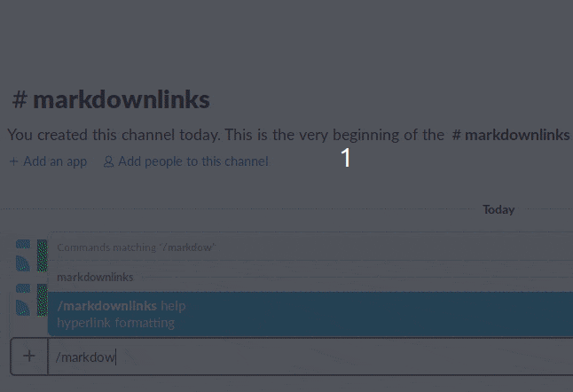

# Welcome to Markdown Links!
[Markdown Links homepage](https://markdownlinks.io)

## Overview
This Slack application allows users to format their messages using Markdown syntax for hyperlinks. While Slack supports several ways to format messages, it does not support a way to cleanly format hyperlinks. Consequently, Slack messages may become cluttered by unkempt URLs. Fortunately, Slack does allow for URLs sent through their API to contain a custom format. The Markdown Links application takes advantage of this.

Slack users activate Markdown Links through the /markdownlinks slash command. Each user can type a message that contains hyperlinks and their associated text, using Markdown hyperlink syntax. This application supports up to twenty hyperlinks in a single message. Additionally, other Slack formatting -such as emojis and strikethroughs- are preserved. Once the user sends the message, Markdown Links will delete the original message and replace it with a message with the hyperlinks cleanly formatted. 

Because the returned message is shown as being from 'markdownlinks', the returned message is also signed with the name of the user who originally shared the message. Additionally, the returned message may be "pinned" to keep its contents easily accessible. However, the contents of the message are not shown in the "preview" of the pinned item.

## Preview

## Installing the application
To install and use Markdown Links on Slack:
1) Sign into the workspace where the application will be used
2) Authorize the application by clicking the attached button

## Providing feedback
To report a bug or request a feature, open an issue in this repository. Alternatively, you may send a message to miller.tim108@gmail.com.

### Security alerts
Please do not post security vulnerabilities to GitHub. Please send security concerns directly to miller.tim108@gmail.com.

## Supporting the community

## Contributing to the code base

### Technology

### Local setup

### Production serving

### Workflow

[Tunnel into ngrok](https://api.slack.com/tutorials/tunneling-with-ngrok)

`ngrok http 4390`

Dockerize

`docker build -t <your username>/markdownlinks .`

`docker run -p 4390:4390 -d <your username>/markdownlinks`

[Lint](https://eslint.org/docs/user-guide/getting-started)

Linting

`npx eslint *.js`

Load Keys from configuration file

`source config.sh`

Auto-load changes with nodemon

`npx nodemon`

Slack Slash Commands

`https://api.slack.com/apps/AHB2H4ABX/slash-commands?saved=1`
